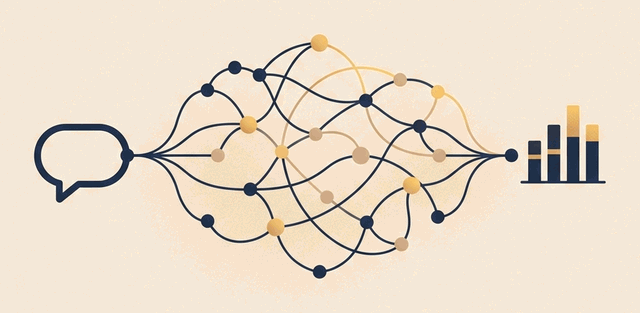

<a href="README.md">Polski</a> | <b>English</b>

### Hi

I'm Kamil. Software engineer at Kooperatywa Online since November 2023 (marketing agency), full-time, remote. I build production AI systems for sales and marketing teams. Open to new opportunities.

English B2. Bachelor's in marketing and sales, Uniwersytet WSB Merito Chorzów, 2020-2024. Based in Siemianowice Śląskie, Poland.

#### What I build

- RAG knowledge bases on Discord
- AI conversation engines (Messenger and web)
- Meta Ads account monitoring
- Call center conversation scoring
- Meta Ads targeting from a brief
- Activation campaigns (email and SMS)

#### Stack

Node.js, TypeScript, Python, PostgreSQL, Redis, Docker, Discord.js, Meta Marketing API, Gemini

#### Links

- Portfolio: https://kamilkaczmareksolutions.com
- Recruiting: recruitment@kamilkaczmareksolutions.com
- LinkedIn: https://www.linkedin.com/in/kamilkaczmareksolutions
