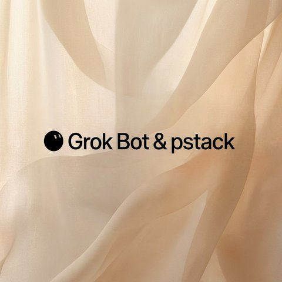

<b>Polski</b> | <a href="README.en.md">English</a>

### Cześć

Jestem Kamil. Programista w Kooperatywa Online od listopada 2023 (agencja marketingowa), pełny etat, zdalnie. Buduję produkcyjne systemy AI dla zespołów sprzedażowych i marketingowych. Szukam nowych wyzwań.

Angielski B2. Licencjat marketing i sprzedaż, Uniwersytet WSB Merito Chorzów, 2020-2024. Katowice.

#### Co buduję

- Bazy wiedzy RAG na Discordzie
- Silniki rozmów AI (Messenger i www)
- Monitoring kont Meta Ads
- Ocena rozmów call center
- Targetowanie Meta Ads z briefu
- Kampanie aktywacyjne mail i SMS

#### Stack

Node.js, TypeScript, Python, PostgreSQL, Redis, Docker, Discord.js, Meta Marketing API, Gemini

#### Linki

- Portfolio: https://kamilkaczmareksolutions.com
- Rekrutacja: recruitment@kamilkaczmareksolutions.com
- LinkedIn: https://www.linkedin.com/in/kamilkaczmareksolutions
